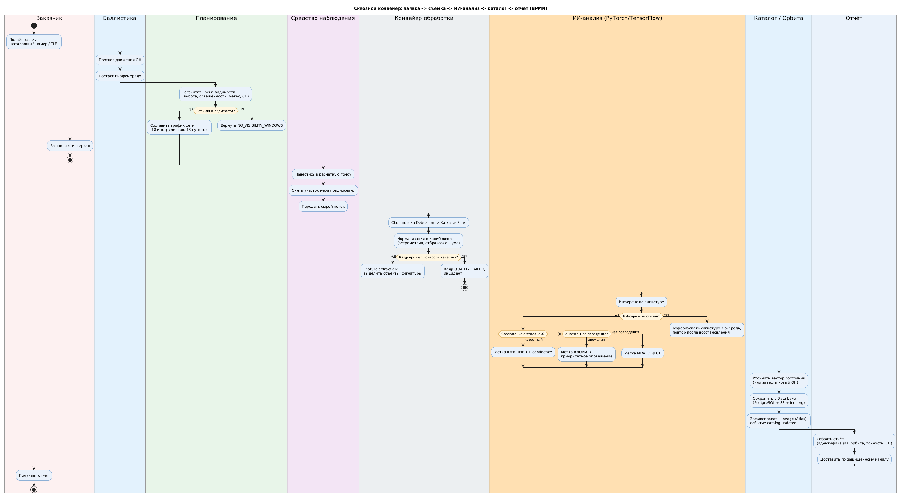
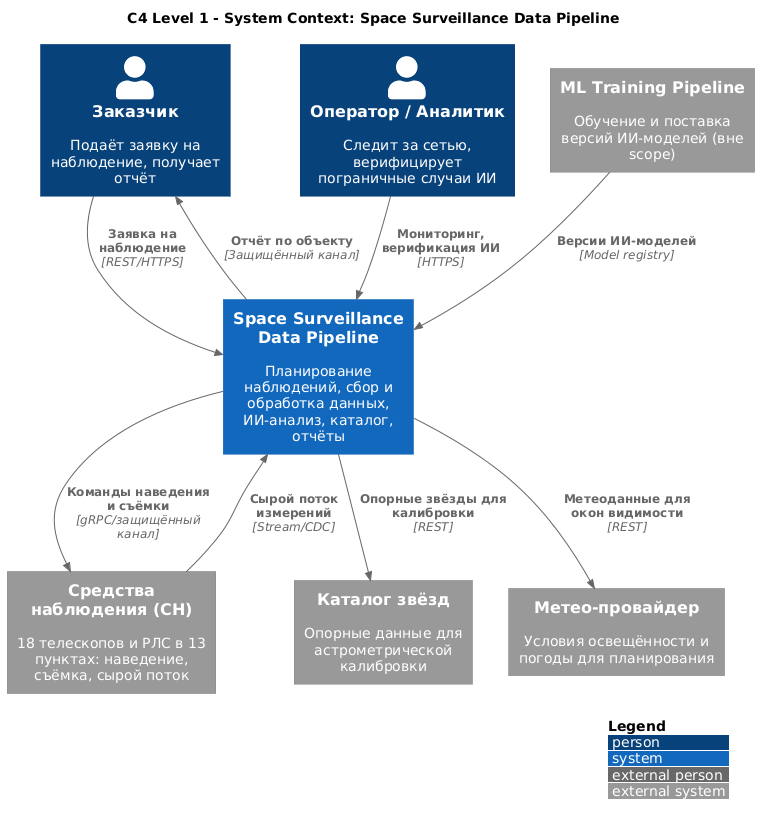
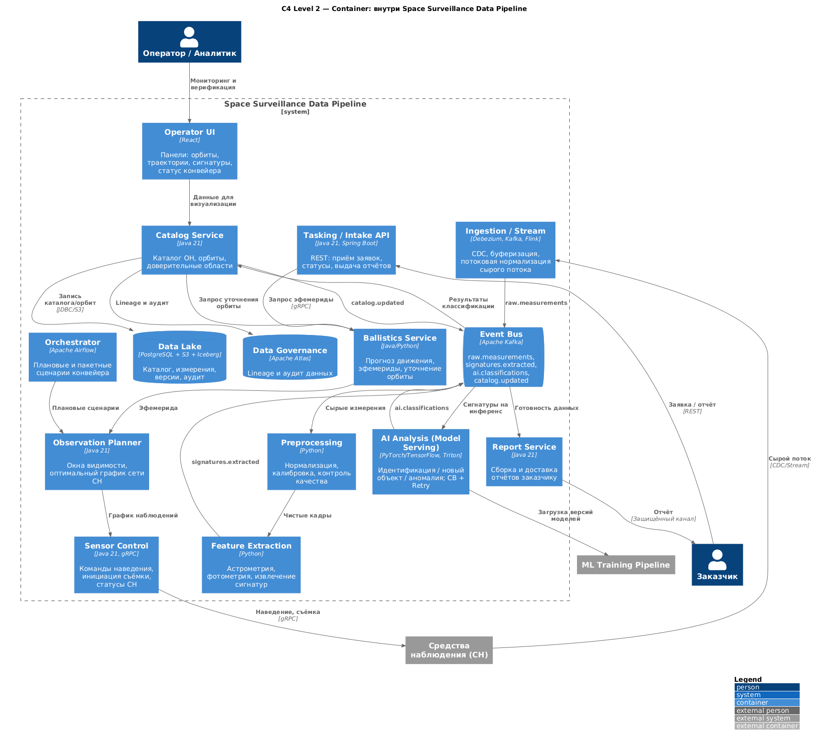
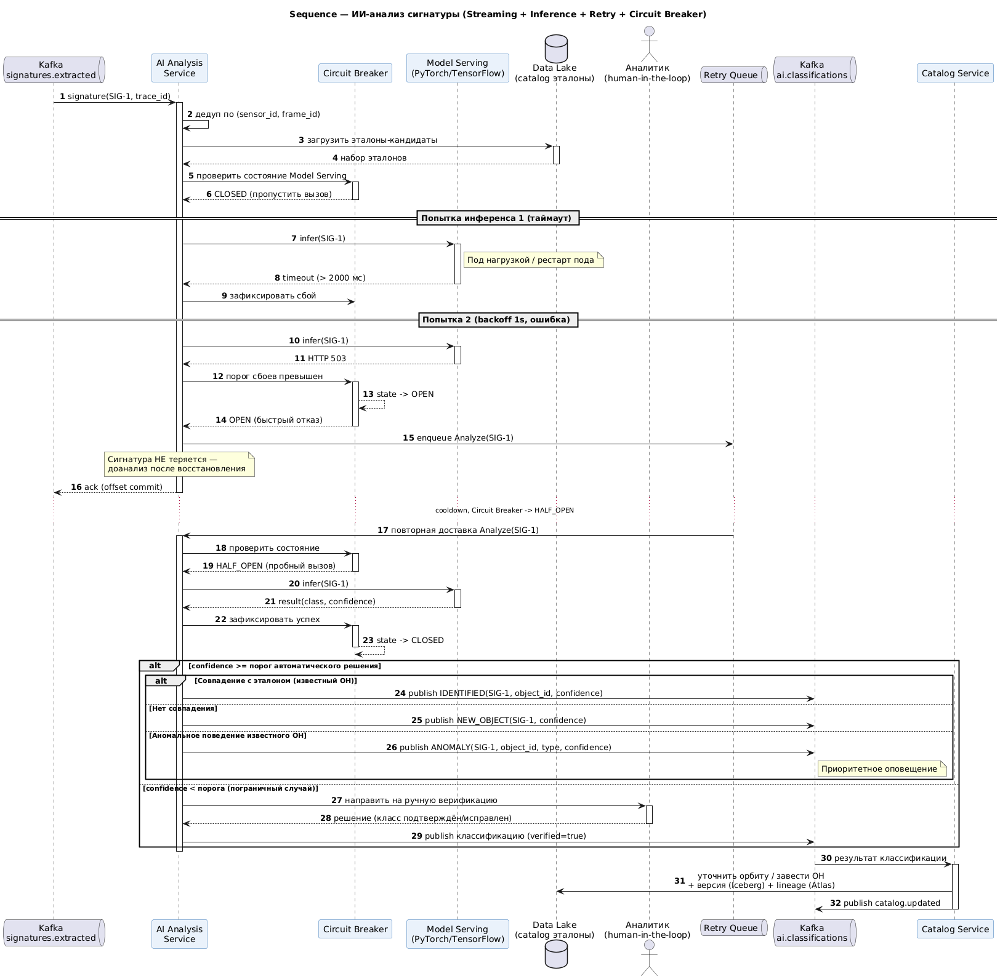
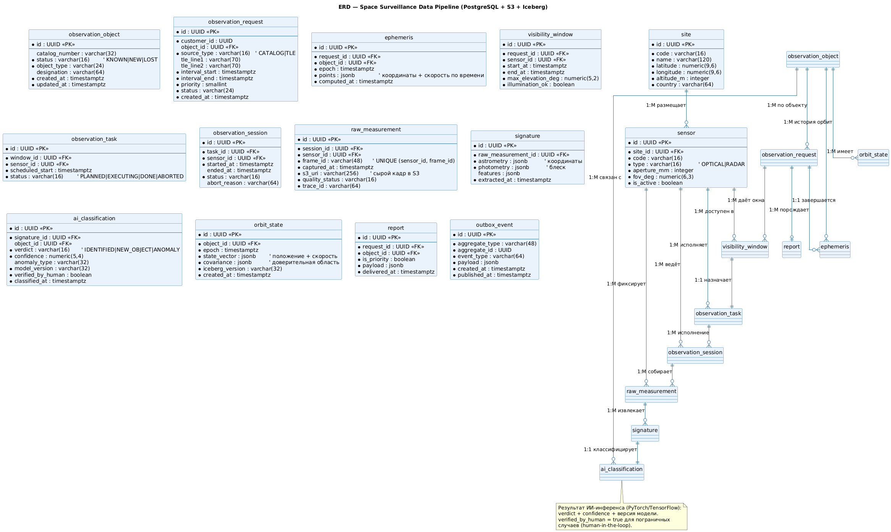
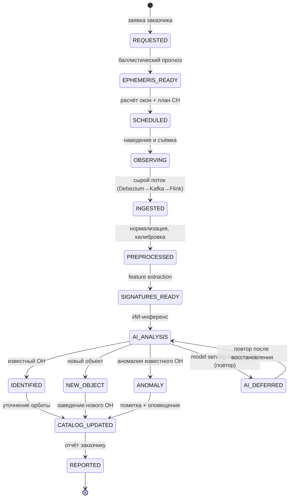

# Space Surveillance Data Pipeline (SSDP)

> Системный анализ и проектирование микросервисного конвейера обработки сигналов
> наблюдения за космическими объектами: от заявки заказчика и планирования работы
> средств наблюдения – через съёмку участка неба и потоковую обработку – к
> **ИИ-анализу** данных, уточнению каталога и отчёту.


---

## 1. Бизнес-контекст

`SSA-Center` (Space Situational Awareness) оказывает заказчикам услуги наблюдения
за космическими объектами (ОН): подтверждение положения известных объектов,
обнаружение новых, выявление нештатного поведения (манёвр, разрушение, изменение
блеска). Сеть наблюдения включает **18 оптических инструментов** (телескопы с
апертурой 180–600 мм), размещённых в **13 пунктах** в РФ и за рубежом, а также
радиосредства.

Раньше процесс был полу-ручным: баллистик считал эфемериду в отдельной программе,
оператор вручную распределял окна наблюдения по телескопам, сырые снимки
обрабатывались пакетно ночными скриптами, а отождествление объектов делалось
человеком по каталогу. Это давало системные ограничения:

- **Низкая пропускная способность**: ручное планирование не успевало
  оптимально загружать 18 инструментов, телескопы простаивали.
- **Задержка результата**: от съёмки до отчёта проходили часы – для манёвров и
  разрушений это критично.
- **Человеческий фактор в отождествлении**: новые объекты и аномалии терялись в
  «шуме», эталонное сравнение по каталогу делалось вручную.
- **Нет единого аудита данных**: измерения и версии каталога жили в разрозненных
  хранилищах без прослеживаемости.

**Space Surveillance Data Pipeline** автоматизирует весь тракт как
микросервисный конвейер: баллистический прогноз (эфемерида), оптимальное
планирование работы средств наблюдения, наведение и сбор сырого потока,
потоковую предобработку и извлечение сигнатур, **ИИ-анализ и классификацию**
(идентификация / новый объект / аномалия), уточнение орбит, версионируемый
каталог в Data Lake и автоматический отчёт заказчику.

### 1.1. ИИ-анализ – ядро системы

Ключевая ценность конвейера – **автоматический ИИ-анализ сигнатур** на базе
**PyTorch / TensorFlow**, который решает три задачи:

| Задача ИИ | Что делает | Бизнес-эффект |
|-----------|------------|---------------|
| **Идентификация известного ОН** | Сопоставляет извлечённую сигнатуру с эталонами каталога | Автоматическое отождествление без оператора |
| **Обнаружение нового объекта** | Маркирует сигнатуру, не совпавшую ни с одним эталоном | Раннее заведение нового ОН в каталог |
| **Детекция аномалий** | Выявляет нештатное поведение известного ОН (манёвр, изменение блеска, фрагментация) | Своевременное оповещение заказчика |

Модели обслуживаются как отдельный сервис инференса (model serving) с
версионированием моделей, мониторингом дрейфа и человеком-в-контуре (human-in-the-loop)
для пограничных случаев. ИИ-сервис изолирован за **Circuit Breaker + Retry**: при
его недоступности сигнатуры буферизуются в очередь и доанализируются позже, не
теряясь.

### Цели проекта и метрики

| Цель | Метрика (KPI) | Базовое значение | Целевое значение |
|------|---------------|------------------|------------------|
| Загрузить сеть наблюдения | Утилизация 18 инструментов | 54 % | **≥ 80 %** |
| Ускорить выдачу результата | Время «съёмка → отчёт» (p95) | ~ 4 ч | **≤ 20 мин** |
| Точность отождествления ИИ | Precision идентификации известных ОН | – | **≥ 99,0 %** |
| Полнота обнаружения нового | Recall обнаружения новых объектов | – | **≥ 95 %** |
| Своевременность аномалий | Доля аномалий, выявленных в течение сеанса | ручной разбор | **≥ 90 %** |
| Прослеживаемость данных | Доля измерений с полным lineage в каталоге | частично | **100 %** |

### Границы системы (Scope)

**In Scope**

- Приём заявки заказчика (каталожный номер, TLE, иные априорные данные).
- Баллистический прогноз движения ОН → построение эфемериды.
- Расчёт окон видимости и планирование работы средств наблюдения (СН).
- Выдача команд наведения и инициация съёмки/радиосеанса.
- Потоковый сбор сырого потока (Debezium → Kafka → Flink), буферизация.
- Нормализация, валидация, калибровка (астрометрия/фотометрия).
- Извлечение сигнатур (feature extraction) объектов.
- **ИИ-анализ и классификация** (идентификация / новый / аномалия).
- Уточнение вектора состояния (орбиты) и обновление каталога.
- Версионируемый Data Lake с аудитом lineage.
- Формирование и доставка отчёта заказчику.

**Out of Scope**

- Физическое управление приводами телескопов (firmware/ПЛК СН – внешний контур).
- Обучение ИИ-моделей (отдельный ML-тренинг-пайплайн; здесь только инференс/serving).
- Биллинг и договорные отношения с заказчиком.
- Метео-прогнозирование (используются внешние метеоданные как вход).
- Каталог звёзд (внешний справочник для астрометрии).
- Долговременное архивное хранение «сырых» снимков сверх политики Data Lake.

---

## 2. Архитектурный подход

SSDP – набор **stateless микросервисов**, взаимодействующих синхронно по **REST**
и **gRPC** (низколатентные внутренние вызовы), и асинхронно – через **событийный
стриминг**. Стиль – **Domain-Driven Design** + **Event-Driven / Streaming
Architecture**.

- **Потоковый конвейер данных**: сырой поток измерений собирается через
  **Debezium → Apache Kafka → Apache Flink**. Debezium фиксирует изменения,
  Kafka обеспечивает надёжную буферизацию и маршрутизацию, Flink выполняет
  первичную нормализацию и распределение измерений по сервисам обработки.
- **Оркестрация**: пакетные и долгоживущие сценарии (план на ночь, переобработка,
  сводные отчёты) оркеструются **Apache Airflow**; внутрисценарные шаги –
  событиями Kafka.
- **ИИ-инференс**: вынесен в отдельный **Model Serving** сервис (PyTorch/TensorFlow,
  Triton/TorchServe), с версионированием моделей и мониторингом дрейфа. Изоляция
  через **Anti-Corruption Layer** + **Circuit Breaker + Retry**.
- **Контракты**: синхронные – **OpenAPI 3.0**, событийные – **AsyncAPI 2.x**
  (топики `raw.measurements`, `signatures.extracted`, `ai.classifications`,
  `catalog.updated`).
- **Data Lake**: **PostgreSQL + S3 + Apache Iceberg** с версионированием схем и
  таблиц, аудит и lineage через **Apache Atlas**.
- **Надёжность событий**: паттерн **Transactional Outbox** + идемпотентные
  консьюмеры (at-least-once). Дедупликация измерений по `(sensor_id, frame_id)`.
- **Наблюдаемость**: сквозной trace_id от заявки до отчёта; операторские панели
  (UX/UI-архитектура) с визуализацией орбит, траекторий и сигнатур в реальном
  времени.

### Стек технологий

| Слой | Технология | Назначение |
|------|------------|------------|
| Сервисы | Java 21 / Spring Boot, Python (ИИ/обработка) | Доменные и обрабатывающие сервисы |
| Синхронные API | REST (OpenAPI 3.0), gRPC | Внешние и внутренние вызовы |
| Событийные API | AsyncAPI 2.x | Контракты Kafka-топиков |
| Стриминг | Debezium, Apache Kafka, Apache Flink | CDC, буферизация, потоковая нормализация |
| Оркестрация | Apache Airflow | Пакетные и плановые сценарии |
| ИИ / ML serving | PyTorch, TensorFlow, Triton/TorchServe | Инференс: идентификация, новизна, аномалии |
| Data Lake | PostgreSQL, S3, Apache Iceberg | Каталог, измерения, версионирование |
| Data Governance | Apache Atlas | Lineage, аудит, прослеживаемость |
| Resilience | Resilience4j / Envoy | Circuit Breaker, Retry, TimeLimiter |
| Наблюдаемость | OpenTelemetry, Prometheus, Grafana | Трейсинг и метрики конвейера |
| Контейнеризация | Docker, Kubernetes | Масштабирование сервисов |

---

## 3. Навигация по репозиторию

```
space-surveillance-pipeline/
├── README.md                     ← вы здесь: контекст, цели, scope, стек, ИИ
├── requirements/
│   ├── user_stories.md           ← User Stories + Acceptance Criteria (Gherkin)
│   └── use_cases.md              ← Спецификации Use Case по акторам
├── diagrams/
│   ├── bpmn.puml                 ← сквозной конвейер (BPMN, пулы/дорожки)
│   ├── c4_model.puml             ← C4: Context + Container (все сервисы)
│   ├── sequence.puml             ← Sequence: ИИ-анализ сигнатуры (стриминг + CB)
│   ├── erd.puml                  ← ER-модель каталога/данных (PK/FK, кардинальность)
│   ├── bpmn_core.xml             ← BPMN 2.0 XML подпроцесса ИИ-классификации
│   └── rendered/                 ← отрисованные PNG/SVG диаграмм
└── api/
    ├── specification.yaml         ← OpenAPI 3.0: POST /observation-requests
    └── asyncapi.yaml              ← AsyncAPI 2.x: событийные Kafka-топики конвейера
```

### Как читать проект

1. README – контекст, цели, границы, роль ИИ.
2. `requirements/` – что система делает и почему (с акцентом на ИИ-анализ).
3. `diagrams/` – от бизнес-процесса (BPMN) к архитектуре (C4), самому сложному
   сценарию (ИИ-анализ, sequence) и модели данных (ERD).
4. `api/` – синхронный контракт (OpenAPI) и событийные контракты (AsyncAPI).

---

## 4. Глоссарий

| Термин | Определение |
|--------|-------------|
| **ОН** | Объект наблюдения (космический объект). |
| **СН** | Средство наблюдения (оптический телескоп, РЛС). |
| **Эфемерида** | Таблица расчётных координат и скорости ОН на моменты времени. |
| **TLE** | Two-Line Elements – стандартный формат элементов орбиты. |
| **Окно видимости** | Интервал, когда ОН доступен для наблюдения с пункта (СН). |
| **Сигнатура** | Компактное описание объекта (астрометрия, фотометрия, спектр). |
| **Feature Extraction** | Извлечение сигнатур из сырых измерений. |
| **Model Serving** | Сервис инференса ИИ-моделей (PyTorch/TensorFlow). |
| **Вектор состояния** | Положение и скорость ОН; основа орбиты. |
| **Lineage** | Прослеживаемость происхождения данных (Apache Atlas). |
| **CDC** | Change Data Capture (Debezium). |

---

## 5. Диаграммы

Ключевые схемы проекта – от бизнес-процесса к данным: сквозной конвейер (BPMN), архитектура (C4: контекст и контейнеры), главный технический сценарий (Sequence), модель данных (ERD) и жизненный цикл обработки наблюдения.

### Сквозной конвейер (BPMN)

Весь конвейер наблюдения одной сквозной нитью: от заявки заказчика и планирования съёмки через потоковую обработку к ИИ-анализу, обновлению каталога и отчёту – с ветвлением по исходу анализа (известный объект / новый / аномалия).



### C4 – System Context

Место конвейера в контуре наблюдения: заявки заказчика, верификация пограничных случаев оператором, управление сетью из 18 телескопов и РЛС в 13 пунктах, опорные данные (каталог звёзд, метео) и поставка версий ИИ-моделей из внешнего ML-пайплайна.



### C4 – Container

Внутреннее устройство конвейера: от баллистики и планировщика окон через управление сетью СН (gRPC) и потоковый ingest (Debezium→Kafka→Flink) к предобработке, извлечению сигнатур и model serving (PyTorch/TensorFlow на Triton с CB + Retry); сверху каталог, отчёты, оркестратор Airflow и операторский UI.



### Sequence – ИИ-анализ сигнатуры (стриминг + Retry + Circuit Breaker)

Особенность – надёжность ИИ-инференса под нагрузкой: при недоступности model serving размыкается Circuit Breaker, сигнатура не теряется и доанализируется после восстановления; пограничные случаи уходят аналитику (human-in-the-loop), аномалии – в приоритетное оповещение.



### ER-модель данных

Модель данных наблюдений: цепочка заявка → эфемериды → окна → задача/сессия → сырые измерения → сигнатуры → вердикт ИИ → уточнение орбиты → отчёт; «тёплые» метаданные в PostgreSQL, «холодные» массивы – в S3 + Iceberg.



### Жизненный цикл обработки наблюдения (диаграмма состояний)

Сквозной путь заявки на наблюдение: баллистический прогноз, планирование окон и
съёмка, потоковый ingest (Debezium→Kafka→Flink), предобработка и feature
extraction, ИИ-инференс с ветвлением исходов (известный объект / новый объект /
аномалия) и отложенным повтором при недоступности model serving, завершение –
обновление каталога и отчёт заказчику:



---

*Автор: Михаил Кузнецов · Senior Systems Analyst / Solution Architect.*
*Документ – деперсонализированный проектный артефакт; не содержит реальных режимных данных, координат пунктов и параметров реальных объектов.*
